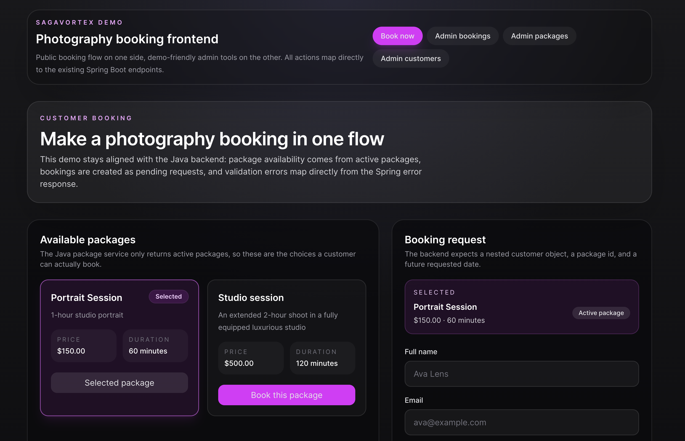

# SagaVortex Booking API

SagaVortex Booking API is a Spring Boot backend for a photography booking system.
It manages photography packages, customers, booking requests, booking status updates,
Flyway database migrations, and PostgreSQL-backed tests.

Demo API URL: [https://sagavortex-booking-api.onrender.com](https://sagavortex-booking-api.onrender.com)
Demo Frontend URL: [https://photography-booking-app-nine.vercel.app/](https://photography-booking-app-nine.vercel.app/)



## Stack

- Java 26
- Spring Boot 4
- Maven
- PostgreSQL
- Spring Data JPA
- Flyway
- Jakarta Validation
- Lombok
- JUnit 5 / Mockito / MockMvc / Testcontainers

## What it does

- Create, update, list, and deactivate photography packages
- Create booking requests tied to customers and packages
- Track booking request status through a small workflow:
  `PENDING -> CONFIRMED -> COMPLETED`, with cancellation allowed from `PENDING` or `CONFIRMED`
- Return consistent JSON error responses for validation failures, not-found cases, and bad requests

## Prerequisites

- Java 26
- Docker

## Run locally

### 1. Start PostgreSQL

```bash
docker compose up -d
```

If you changed database credentials after the container was first created, recreate the volume:

```bash
docker compose down -v
docker compose up -d
```

### 2. Run the application

```bash
mvn spring-boot:run
```

or with the Maven wrapper:

```bash
./mvnw spring-boot:run
```

The API runs at `http://localhost:8080`.

## Useful Maven commands

```bash
mvn compile
mvn test
mvn spring-boot:run
```

Wrapper equivalents:

```bash
./mvnw compile
./mvnw test
./mvnw spring-boot:run
```

## Documentation

- [API docs](docs/API.md)
- [Deployment docs](docs/DEPLOYMENT.md)
- [Frontend deploy docs](docs/FRONTEND_DEPLOY.md)

## Tests

Run the full test suite:

```bash
mvn test
```

Current test coverage includes:

- service unit tests with Mockito
- controller tests with MockMvc
- PostgreSQL integration tests with Testcontainers
